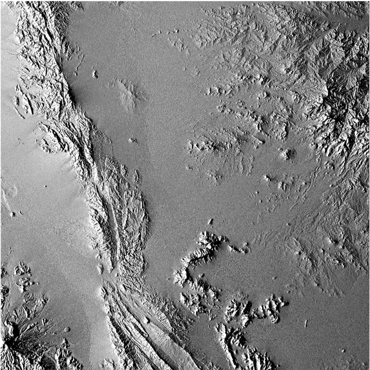
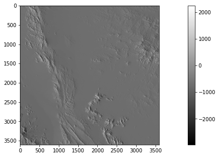

<a href="https://colab.research.google.com/github/moienr/Incdient-Solar-Energy/blob/main/Coolbaugh.ipynb" target="_parent"></a>

# Incdient Solar Energy over time - Coolbaugh Algorithm - (Shaded Relief)
**Theraml RS class of University of Tehran** - `Dr. Majid Kiavarz`

This is an Unofficial Python Implemntaion based on:
[*"Detection of geothermal anomalies using Advanced Spaceborne Thermal Emission and Reflection Radiometer (ASTER) thermal infrared images at Bradys Hot Springs, Nevada, USA - M.F. Coolbaugh el al."*](https://doi.org/10.1016/j.rse.2006.09.001)

2021-22 Second Semester

Student: `Moien Rangzan`


[Data in Colab](https://drive.google.com/drive/folders/1SNANpnL-M4zCxAFrisNUa09s_15C-7GT?usp=sharing)


## Coolbaugh formula directly from Dr.Kiavarz notes


## final resault
The final result (with Histogram Stretching):



## Diffrence

one usfeul thing that I found is; now that we wrote our code in a functial way we can calculate ise for diffrent hours, days and seasons, and compare the Incdient solar energy:

the image below is the difrrence between two hours


```python

plt.imshow(cb['ise_list'][1]-cb['ise_list'][2],cmap='gray')
plt.colorbar()
plt.show()
```


    

    

