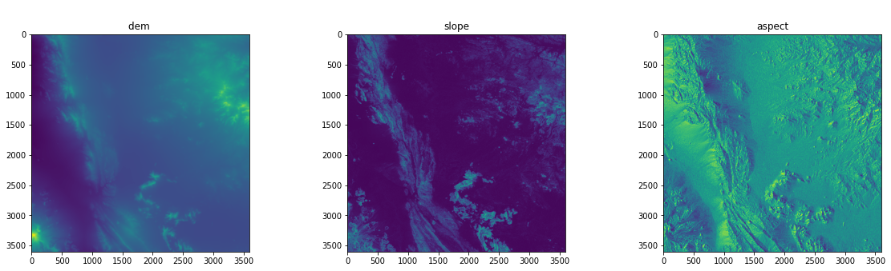
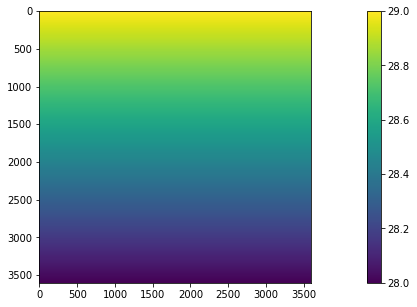
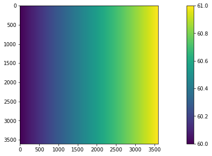
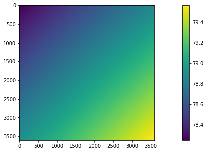
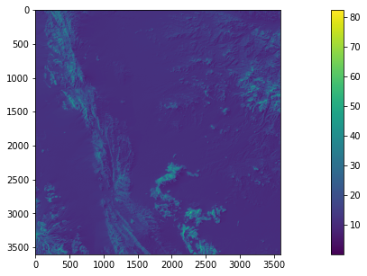
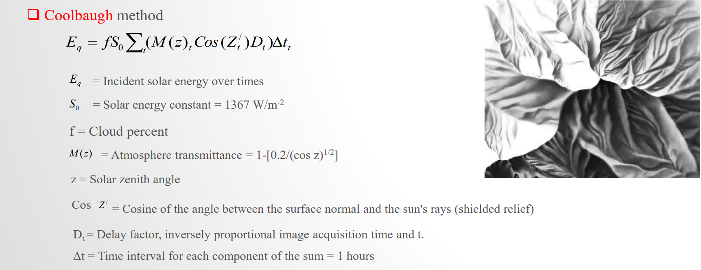
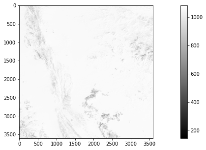
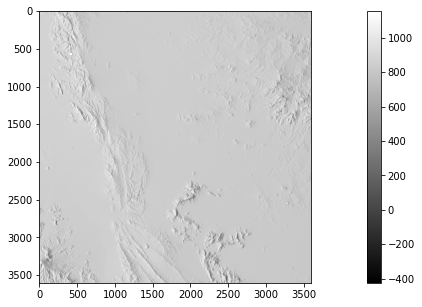
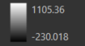
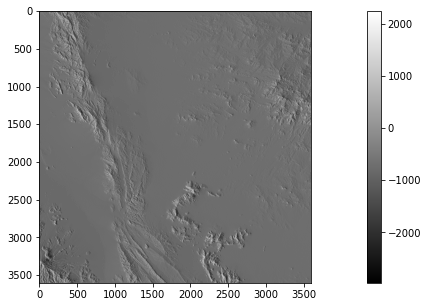

---
jupyter:
  colab:
  kernelspec:
    display_name: Python 3
    name: python3
  language_info:
    name: python
  nbformat: 4
  nbformat_minor: 0
  widgets:
    application/vnd.jupyter.widget-state+json:
      06f27e910d584b26935879a3a67b106b:
        model_module: \@jupyter-widgets/controls
        model_module_version: 1.5.0
        model_name: ProgressStyleModel
        state:
          _model_module: \@jupyter-widgets/controls
          _model_module_version: 1.5.0
          _model_name: ProgressStyleModel
          _view_module: \@jupyter-widgets/base
          _view_module_version: 1.2.0
          _view_name: StyleView
      070778edb115498697941520fc1362e2:
        model_module: \@jupyter-widgets/controls
        model_module_version: 1.5.0
        model_name: IntProgressModel
        state:
          _model_module: \@jupyter-widgets/controls
          _model_module_version: 1.5.0
          _model_name: IntProgressModel
          _view_module: \@jupyter-widgets/controls
          _view_module_version: 1.5.0
          _view_name: ProgressView
          layout: IPY_MODEL_e6da50c2b9a746459cba15bb50c63940
          max: 5184
          min: 0
          orientation: horizontal
          style: IPY_MODEL_6d089a2ca6174bac80ae88be84afd009
          value: 5184
      086b323c1ea04221895e99fef3559b79:
        model_module: \@jupyter-widgets/controls
        model_module_version: 1.5.0
        model_name: IntProgressModel
        state:
          _model_module: \@jupyter-widgets/controls
          _model_module_version: 1.5.0
          _model_name: IntProgressModel
          _view_module: \@jupyter-widgets/controls
          _view_module_version: 1.5.0
          _view_name: ProgressView
          layout: IPY_MODEL_1ed0a4b2eeec4dc78ae61e656c6788ce
          max: 5184
          min: 0
          orientation: horizontal
          style: IPY_MODEL_7badd08815334d518de307f368dfe737
          value: 5184
      1ed0a4b2eeec4dc78ae61e656c6788ce:
        model_module: \@jupyter-widgets/base
        model_module_version: 1.2.0
        model_name: LayoutModel
        state:
          _model_module: \@jupyter-widgets/base
          _model_module_version: 1.2.0
          _model_name: LayoutModel
          _view_module: \@jupyter-widgets/base
          _view_module_version: 1.2.0
          _view_name: LayoutView
      264ff874291a422abaf8768788c2a2a2:
        model_module: \@jupyter-widgets/controls
        model_module_version: 1.5.0
        model_name: ProgressStyleModel
        state:
          _model_module: \@jupyter-widgets/controls
          _model_module_version: 1.5.0
          _model_name: ProgressStyleModel
          _view_module: \@jupyter-widgets/base
          _view_module_version: 1.2.0
          _view_name: StyleView
      26d165da8273424ba32ee630382c3001:
        model_module: \@jupyter-widgets/controls
        model_module_version: 1.5.0
        model_name: IntProgressModel
        state:
          _model_module: \@jupyter-widgets/controls
          _model_module_version: 1.5.0
          _model_name: IntProgressModel
          _view_module: \@jupyter-widgets/controls
          _view_module_version: 1.5.0
          _view_name: ProgressView
          layout: IPY_MODEL_8092227a344441909fc5ea7a0cb34cc0
          max: 5184
          min: 0
          orientation: horizontal
          style: IPY_MODEL_3f80d30898464552abb06af72de0d861
          value: 5184
      26e590b18afe47be866d91a56d1b3734:
        model_module: \@jupyter-widgets/controls
        model_module_version: 1.5.0
        model_name: IntProgressModel
        state:
          _model_module: \@jupyter-widgets/controls
          _model_module_version: 1.5.0
          _model_name: IntProgressModel
          _view_module: \@jupyter-widgets/controls
          _view_module_version: 1.5.0
          _view_name: ProgressView
          layout: IPY_MODEL_befaa42407ab45ea8267a5b7eec37ffb
          max: 5184
          min: 0
          orientation: horizontal
          style: IPY_MODEL_3ce7d8cd8aff4b07a13dcc9b2d02717c
          value: 5184
      287386c6042e42c888cd627e187e5ba8:
        model_module: \@jupyter-widgets/base
        model_module_version: 1.2.0
        model_name: LayoutModel
        state:
          _model_module: \@jupyter-widgets/base
          _model_module_version: 1.2.0
          _model_name: LayoutModel
          _view_module: \@jupyter-widgets/base
          _view_module_version: 1.2.0
          _view_name: LayoutView
      335ef3db2ade4c0cbd4780c9b773a585:
        model_module: \@jupyter-widgets/base
        model_module_version: 1.2.0
        model_name: LayoutModel
        state:
          _model_module: \@jupyter-widgets/base
          _model_module_version: 1.2.0
          _model_name: LayoutModel
          _view_module: \@jupyter-widgets/base
          _view_module_version: 1.2.0
          _view_name: LayoutView
      3ce7d8cd8aff4b07a13dcc9b2d02717c:
        model_module: \@jupyter-widgets/controls
        model_module_version: 1.5.0
        model_name: ProgressStyleModel
        state:
          _model_module: \@jupyter-widgets/controls
          _model_module_version: 1.5.0
          _model_name: ProgressStyleModel
          _view_module: \@jupyter-widgets/base
          _view_module_version: 1.2.0
          _view_name: StyleView
      3f80d30898464552abb06af72de0d861:
        model_module: \@jupyter-widgets/controls
        model_module_version: 1.5.0
        model_name: ProgressStyleModel
        state:
          _model_module: \@jupyter-widgets/controls
          _model_module_version: 1.5.0
          _model_name: ProgressStyleModel
          _view_module: \@jupyter-widgets/base
          _view_module_version: 1.2.0
          _view_name: StyleView
      42dc428dec6c44a7b4362bccfaaa6120:
        model_module: \@jupyter-widgets/controls
        model_module_version: 1.5.0
        model_name: IntProgressModel
        state:
          _model_module: \@jupyter-widgets/controls
          _model_module_version: 1.5.0
          _model_name: IntProgressModel
          _view_module: \@jupyter-widgets/controls
          _view_module_version: 1.5.0
          _view_name: ProgressView
          layout: IPY_MODEL_335ef3db2ade4c0cbd4780c9b773a585
          max: 5184
          min: 0
          orientation: horizontal
          style: IPY_MODEL_c4fb0289adcd4975817609edd10242f4
          value: 5184
      443389c64a444a03a1e33a541ba5a54a:
        model_module: \@jupyter-widgets/controls
        model_module_version: 1.5.0
        model_name: IntProgressModel
        state:
          _model_module: \@jupyter-widgets/controls
          _model_module_version: 1.5.0
          _model_name: IntProgressModel
          _view_module: \@jupyter-widgets/controls
          _view_module_version: 1.5.0
          _view_name: ProgressView
          layout: IPY_MODEL_5e50f45adf6542cf9a7cb81d0e6e4463
          max: 5184
          min: 0
          orientation: horizontal
          style: IPY_MODEL_a40c75fba77e4d6ab2af183438cd8ccb
          value: 5184
      4b4767466890409a8e8fd0764d6860b7:
        model_module: \@jupyter-widgets/controls
        model_module_version: 1.5.0
        model_name: ProgressStyleModel
        state:
          _model_module: \@jupyter-widgets/controls
          _model_module_version: 1.5.0
          _model_name: ProgressStyleModel
          _view_module: \@jupyter-widgets/base
          _view_module_version: 1.2.0
          _view_name: StyleView
      5e50f45adf6542cf9a7cb81d0e6e4463:
        model_module: \@jupyter-widgets/base
        model_module_version: 1.2.0
        model_name: LayoutModel
        state:
          _model_module: \@jupyter-widgets/base
          _model_module_version: 1.2.0
          _model_name: LayoutModel
          _view_module: \@jupyter-widgets/base
          _view_module_version: 1.2.0
          _view_name: LayoutView
      6d089a2ca6174bac80ae88be84afd009:
        model_module: \@jupyter-widgets/controls
        model_module_version: 1.5.0
        model_name: ProgressStyleModel
        state:
          _model_module: \@jupyter-widgets/controls
          _model_module_version: 1.5.0
          _model_name: ProgressStyleModel
          _view_module: \@jupyter-widgets/base
          _view_module_version: 1.2.0
          _view_name: StyleView
      7badd08815334d518de307f368dfe737:
        model_module: \@jupyter-widgets/controls
        model_module_version: 1.5.0
        model_name: ProgressStyleModel
        state:
          _model_module: \@jupyter-widgets/controls
          _model_module_version: 1.5.0
          _model_name: ProgressStyleModel
          _view_module: \@jupyter-widgets/base
          _view_module_version: 1.2.0
          _view_name: StyleView
      8092227a344441909fc5ea7a0cb34cc0:
        model_module: \@jupyter-widgets/base
        model_module_version: 1.2.0
        model_name: LayoutModel
        state:
          _model_module: \@jupyter-widgets/base
          _model_module_version: 1.2.0
          _model_name: LayoutModel
          _view_module: \@jupyter-widgets/base
          _view_module_version: 1.2.0
          _view_name: LayoutView
      836f55b823c540c5a8b6a164a341b45d:
        model_module: \@jupyter-widgets/base
        model_module_version: 1.2.0
        model_name: LayoutModel
        state:
          _model_module: \@jupyter-widgets/base
          _model_module_version: 1.2.0
          _model_name: LayoutModel
          _view_module: \@jupyter-widgets/base
          _view_module_version: 1.2.0
          _view_name: LayoutView
      853ba0be6568408181b34c53ca090fe0:
        model_module: \@jupyter-widgets/controls
        model_module_version: 1.5.0
        model_name: ProgressStyleModel
        state:
          _model_module: \@jupyter-widgets/controls
          _model_module_version: 1.5.0
          _model_name: ProgressStyleModel
          _view_module: \@jupyter-widgets/base
          _view_module_version: 1.2.0
          _view_name: StyleView
      87939b7db4054a0dabbaca71026a722e:
        model_module: \@jupyter-widgets/controls
        model_module_version: 1.5.0
        model_name: ProgressStyleModel
        state:
          _model_module: \@jupyter-widgets/controls
          _model_module_version: 1.5.0
          _model_name: ProgressStyleModel
          _view_module: \@jupyter-widgets/base
          _view_module_version: 1.2.0
          _view_name: StyleView
      9b726058172e43f99542868475e44a44:
        model_module: \@jupyter-widgets/controls
        model_module_version: 1.5.0
        model_name: IntProgressModel
        state:
          _model_module: \@jupyter-widgets/controls
          _model_module_version: 1.5.0
          _model_name: IntProgressModel
          _view_module: \@jupyter-widgets/controls
          _view_module_version: 1.5.0
          _view_name: ProgressView
          layout: IPY_MODEL_d7bcffd2aa114937b3e8338ad67e0b2d
          max: 5184
          min: 0
          orientation: horizontal
          style: IPY_MODEL_f9e1bd6abb524f1f9c7dc98f2ff7eac9
          value: 5184
      a40c75fba77e4d6ab2af183438cd8ccb:
        model_module: \@jupyter-widgets/controls
        model_module_version: 1.5.0
        model_name: ProgressStyleModel
        state:
          _model_module: \@jupyter-widgets/controls
          _model_module_version: 1.5.0
          _model_name: ProgressStyleModel
          _view_module: \@jupyter-widgets/base
          _view_module_version: 1.2.0
          _view_name: StyleView
      b54ca242c2cd45ba813589471b162da7:
        model_module: \@jupyter-widgets/controls
        model_module_version: 1.5.0
        model_name: IntProgressModel
        state:
          _model_module: \@jupyter-widgets/controls
          _model_module_version: 1.5.0
          _model_name: IntProgressModel
          _view_module: \@jupyter-widgets/controls
          _view_module_version: 1.5.0
          _view_name: ProgressView
          layout: IPY_MODEL_bb89d81161c8431890866465162ae521
          max: 5184
          min: 0
          orientation: horizontal
          style: IPY_MODEL_264ff874291a422abaf8768788c2a2a2
          value: 5184
      b7cc7fa97b764fc9a24c0fff7c0580a8:
        model_module: \@jupyter-widgets/base
        model_module_version: 1.2.0
        model_name: LayoutModel
        state:
          _model_module: \@jupyter-widgets/base
          _model_module_version: 1.2.0
          _model_name: LayoutModel
          _view_module: \@jupyter-widgets/base
          _view_module_version: 1.2.0
          _view_name: LayoutView
      bb89d81161c8431890866465162ae521:
        model_module: \@jupyter-widgets/base
        model_module_version: 1.2.0
        model_name: LayoutModel
        state:
          _model_module: \@jupyter-widgets/base
          _model_module_version: 1.2.0
          _model_name: LayoutModel
          _view_module: \@jupyter-widgets/base
          _view_module_version: 1.2.0
          _view_name: LayoutView
      befaa42407ab45ea8267a5b7eec37ffb:
        model_module: \@jupyter-widgets/base
        model_module_version: 1.2.0
        model_name: LayoutModel
        state:
          _model_module: \@jupyter-widgets/base
          _model_module_version: 1.2.0
          _model_name: LayoutModel
          _view_module: \@jupyter-widgets/base
          _view_module_version: 1.2.0
          _view_name: LayoutView
      c4fb0289adcd4975817609edd10242f4:
        model_module: \@jupyter-widgets/controls
        model_module_version: 1.5.0
        model_name: ProgressStyleModel
        state:
          _model_module: \@jupyter-widgets/controls
          _model_module_version: 1.5.0
          _model_name: ProgressStyleModel
          _view_module: \@jupyter-widgets/base
          _view_module_version: 1.2.0
          _view_name: StyleView
      cc0b57b62a3f4429834cfc8c78b85012:
        model_module: \@jupyter-widgets/base
        model_module_version: 1.2.0
        model_name: LayoutModel
        state:
          _model_module: \@jupyter-widgets/base
          _model_module_version: 1.2.0
          _model_name: LayoutModel
          _view_module: \@jupyter-widgets/base
          _view_module_version: 1.2.0
          _view_name: LayoutView
      d1e0bb6179414bd5962831b9835bb46f:
        model_module: \@jupyter-widgets/base
        model_module_version: 1.2.0
        model_name: LayoutModel
        state:
          _model_module: \@jupyter-widgets/base
          _model_module_version: 1.2.0
          _model_name: LayoutModel
          _view_module: \@jupyter-widgets/base
          _view_module_version: 1.2.0
          _view_name: LayoutView
      d7bcffd2aa114937b3e8338ad67e0b2d:
        model_module: \@jupyter-widgets/base
        model_module_version: 1.2.0
        model_name: LayoutModel
        state:
          _model_module: \@jupyter-widgets/base
          _model_module_version: 1.2.0
          _model_name: LayoutModel
          _view_module: \@jupyter-widgets/base
          _view_module_version: 1.2.0
          _view_name: LayoutView
      d7c713aeb5004af49ccc6cfa283874fd:
        model_module: \@jupyter-widgets/controls
        model_module_version: 1.5.0
        model_name: IntProgressModel
        state:
          _model_module: \@jupyter-widgets/controls
          _model_module_version: 1.5.0
          _model_name: IntProgressModel
          _view_module: \@jupyter-widgets/controls
          _view_module_version: 1.5.0
          _view_name: ProgressView
          layout: IPY_MODEL_836f55b823c540c5a8b6a164a341b45d
          max: 5184
          min: 0
          orientation: horizontal
          style: IPY_MODEL_06f27e910d584b26935879a3a67b106b
          value: 5184
      d8424ad2c1274dd7b3ee70284c9c30fa:
        model_module: \@jupyter-widgets/controls
        model_module_version: 1.5.0
        model_name: IntProgressModel
        state:
          _model_module: \@jupyter-widgets/controls
          _model_module_version: 1.5.0
          _model_name: IntProgressModel
          _view_module: \@jupyter-widgets/controls
          _view_module_version: 1.5.0
          _view_name: ProgressView
          layout: IPY_MODEL_287386c6042e42c888cd627e187e5ba8
          max: 5184
          min: 0
          orientation: horizontal
          style: IPY_MODEL_e2510f7904b34a7ea1ae3baea2ed4b5d
          value: 5184
      e043157c2b1040a587f5e8f7700d750b:
        model_module: \@jupyter-widgets/controls
        model_module_version: 1.5.0
        model_name: IntProgressModel
        state:
          _model_module: \@jupyter-widgets/controls
          _model_module_version: 1.5.0
          _model_name: IntProgressModel
          _view_module: \@jupyter-widgets/controls
          _view_module_version: 1.5.0
          _view_name: ProgressView
          layout: IPY_MODEL_d1e0bb6179414bd5962831b9835bb46f
          max: 5184
          min: 0
          orientation: horizontal
          style: IPY_MODEL_87939b7db4054a0dabbaca71026a722e
          value: 5184
      e2510f7904b34a7ea1ae3baea2ed4b5d:
        model_module: \@jupyter-widgets/controls
        model_module_version: 1.5.0
        model_name: ProgressStyleModel
        state:
          _model_module: \@jupyter-widgets/controls
          _model_module_version: 1.5.0
          _model_name: ProgressStyleModel
          _view_module: \@jupyter-widgets/base
          _view_module_version: 1.2.0
          _view_name: StyleView
      e6da50c2b9a746459cba15bb50c63940:
        model_module: \@jupyter-widgets/base
        model_module_version: 1.2.0
        model_name: LayoutModel
        state:
          _model_module: \@jupyter-widgets/base
          _model_module_version: 1.2.0
          _model_name: LayoutModel
          _view_module: \@jupyter-widgets/base
          _view_module_version: 1.2.0
          _view_name: LayoutView
      e7472347fe0948569785bf88d4af4bd5:
        model_module: \@jupyter-widgets/controls
        model_module_version: 1.5.0
        model_name: IntProgressModel
        state:
          _model_module: \@jupyter-widgets/controls
          _model_module_version: 1.5.0
          _model_name: IntProgressModel
          _view_module: \@jupyter-widgets/controls
          _view_module_version: 1.5.0
          _view_name: ProgressView
          layout: IPY_MODEL_b7cc7fa97b764fc9a24c0fff7c0580a8
          max: 5184
          min: 0
          orientation: horizontal
          style: IPY_MODEL_4b4767466890409a8e8fd0764d6860b7
          value: 5184
      ed6fded95e3841a9a1c8e0d413ccb6f0:
        model_module: \@jupyter-widgets/controls
        model_module_version: 1.5.0
        model_name: IntProgressModel
        state:
          _model_module: \@jupyter-widgets/controls
          _model_module_version: 1.5.0
          _model_name: IntProgressModel
          _view_module: \@jupyter-widgets/controls
          _view_module_version: 1.5.0
          _view_name: ProgressView
          layout: IPY_MODEL_cc0b57b62a3f4429834cfc8c78b85012
          max: 5184
          min: 0
          orientation: horizontal
          style: IPY_MODEL_853ba0be6568408181b34c53ca090fe0
          value: 5184
      f9e1bd6abb524f1f9c7dc98f2ff7eac9:
        model_module: \@jupyter-widgets/controls
        model_module_version: 1.5.0
        model_name: ProgressStyleModel
        state:
          _model_module: \@jupyter-widgets/controls
          _model_module_version: 1.5.0
          _model_name: ProgressStyleModel
          _view_module: \@jupyter-widgets/base
          _view_module_version: 1.2.0
          _view_name: StyleView
---

::: {.cell .markdown id="r3RUUHAYlz38"}
# Incdient Solar Energy over time - Coolbaugh Algorithm

Theraml RS class of University of Tehran - `Dr. Kiavarz`

Student: `Moien Rangzan`
:::

::: {.cell .code colab="{\"base_uri\":\"https://localhost:8080/\"}" id="vptFyRVrBAhO" outputId="67a7e5d5-925a-4566-a33c-e2f54f73dfe8"}
``` {.python}
from google.colab import drive
drive.mount('/content/drive')
```

::: {.output .stream .stdout}
    Drive already mounted at /content/drive; to attempt to forcibly remount, call drive.mount("/content/drive", force_remount=True).
:::
:::

::: {.cell .code colab="{\"base_uri\":\"https://localhost:8080/\"}" id="RnONmR3nCGH3" outputId="197720ea-567a-4bf3-852e-f62b5a5b75e8"}
``` {.python}
!pip install rasterio
```

::: {.output .stream .stdout}
    Requirement already satisfied: rasterio in /usr/local/lib/python3.7/dist-packages (1.2.10)
    Requirement already satisfied: click>=4.0 in /usr/local/lib/python3.7/dist-packages (from rasterio) (7.1.2)
    Requirement already satisfied: snuggs>=1.4.1 in /usr/local/lib/python3.7/dist-packages (from rasterio) (1.4.7)
    Requirement already satisfied: click-plugins in /usr/local/lib/python3.7/dist-packages (from rasterio) (1.1.1)
    Requirement already satisfied: setuptools in /usr/local/lib/python3.7/dist-packages (from rasterio) (57.4.0)
    Requirement already satisfied: affine in /usr/local/lib/python3.7/dist-packages (from rasterio) (2.3.1)
    Requirement already satisfied: cligj>=0.5 in /usr/local/lib/python3.7/dist-packages (from rasterio) (0.7.2)
    Requirement already satisfied: numpy in /usr/local/lib/python3.7/dist-packages (from rasterio) (1.21.6)
    Requirement already satisfied: attrs in /usr/local/lib/python3.7/dist-packages (from rasterio) (21.4.0)
    Requirement already satisfied: certifi in /usr/local/lib/python3.7/dist-packages (from rasterio) (2021.10.8)
    Requirement already satisfied: pyparsing>=2.1.6 in /usr/local/lib/python3.7/dist-packages (from snuggs>=1.4.1->rasterio) (3.0.8)
:::
:::

::: {.cell .code id="heYrwbfJCA9-"}
``` {.python}
import os
import numpy as np
import matplotlib
import matplotlib.pyplot as plt
import gdal
import rasterio
```
:::

::: {.cell .markdown id="T16Z59fDDhBN"}
## Getting the coordiantes of our DEM:

`dem.boudns` gives us the latitude and longitude that we can further use
:::

::: {.cell .code colab="{\"base_uri\":\"https://localhost:8080/\"}" id="VxPnvCgOCEbi" outputId="42422270-c90d-409a-953c-5224f560bac9"}
``` {.python}
import rasterio
dem = rasterio.open('/content/drive/MyDrive/Colab Notebooks/solar_radiation/bazmandem.tif')
#left edge
long_left = dem.bounds[0]
print(long_left)
#bottom edge
lat_butt = dem.bounds[1]
print(lat_butt)
#right edge
long_right = dem.bounds[2]
print(long_right)
#top edge
lat_top = dem.bounds[3]
print(lat_top)
```

::: {.output .stream .stdout}
    59.99986111111111
    27.999861111111112
    61.000138888888884
    29.00013888888889
:::
:::

::: {.cell .markdown id="KFnzZ1GbDj3T"}
## io to numpy array

to change the file into numpy we use `.read()` method
:::

::: {.cell .code colab="{\"base_uri\":\"https://localhost:8080/\"}" id="6TQvES-NDojG" outputId="1bebce89-cd86-4b6b-c207-3d3c406af3dd"}
``` {.python}
print(type(dem))
dem =dem.read()
print(type(dem))
```

::: {.output .stream .stdout}
    <class 'rasterio.io.DatasetReader'>
    <class 'numpy.ndarray'>
:::
:::

::: {.cell .code colab="{\"base_uri\":\"https://localhost:8080/\"}" id="XphrMAg9DvRA" outputId="5e521767-0950-4caa-b745-7f9e478b7b7b"}
``` {.python}
dem.shape
```

::: {.output .execute_result execution_count="6"}
    (1, 3601, 3601)
:::
:::

::: {.cell .code colab="{\"base_uri\":\"https://localhost:8080/\"}" id="dmFq12mSD150" outputId="9a34e352-558f-4c90-9e56-6bf9ca88f707"}
``` {.python}
slp = rasterio.open('/content/drive/MyDrive/Colab Notebooks/solar_radiation/bazman_slope.tif')
asp = rasterio.open('/content/drive/MyDrive/Colab Notebooks/solar_radiation/bazman_aspect.tif')
slp =slp.read()
asp =asp.read()
print(slp.shape)
print(asp.shape)
```

::: {.output .stream .stdout}
    (1, 3601, 3601)
    (1, 3601, 3601)
:::
:::

::: {.cell .markdown id="aYw6Yi3hD9RM"}
as we can see our arrays have an extra dimention, which is usfull when
we have multiple bands, but now that we have only one band we use
`np.squeez` to remove these extra dims
:::

::: {.cell .code colab="{\"base_uri\":\"https://localhost:8080/\"}" id="OJoQtGOtD6ZI" outputId="61b364e9-9d62-4fac-8deb-abc2bdf374ed"}
``` {.python}
dem = np.squeeze(dem)
slp = np.squeeze(slp)
asp = np.squeeze(asp)

print(dem.shape)
print(slp.shape)
print(asp.shape)
```

::: {.output .stream .stdout}
    (3601, 3601)
    (3601, 3601)
    (3601, 3601)
:::
:::

::: {.cell .markdown id="-I79r2UAWZEa"}
## cut it some slack - WE DONT DO THIS

this is abseloutly a wrong phrase to use but well, in the darkness here
comes the nothing

so finding solar incident angle is really process extensive and it takes
hours to be calculated for a `3500x3500` raster so i\'m using a subset
of `200x300`

***SINCE WE INTRODUNCED DOWN_SAMPLING FACTOR IN SUN_POSITION FUNCTION,
WE DONT NEED TO TAKE A SUBSET ON LARGE DEM WE CAN CHOOSE BIGGER
DOWNSAMPLING FACTOR!***
:::

::: {.cell .code id="akhncOYaVzsC"}
``` {.python}
# dem = dem[0:200,0:300]
# slp = slp[0:200,0:300]
# asp = asp[0:200,0:300]
```
:::

::: {.cell .code colab="{\"height\":374,\"base_uri\":\"https://localhost:8080/\"}" id="-glENbP7EAOY" outputId="a7e50da8-5af9-4d80-deb3-1bff631ec886"}
``` {.python}
fig, (ax1, ax2,ax3) = plt.subplots(1, 3)
plt.rcParams['figure.figsize'] = [20,5]
fig.suptitle(' ')
ax1.imshow(dem)
ax1.set_title('dem ')
ax2.imshow(slp)
ax2.set_title('slope')
ax3.imshow(asp)
ax3.set_title('aspect')
```

::: {.output .execute_result execution_count="64"}
    Text(0.5, 1.0, 'aspect')
:::

::: {.output .display_data}

:::
:::

::: {.cell .markdown id="fOm9Ypz7IW8O"}
# Latitude and longitude of each pixel

creating two rasters, one contaiong latitude of each pixel and one for
longitude we are interpolating each pixel lat and long using linespace

there are so many things going on in this function so I\'ll try to
explain them all:

`np.linspace(start,stop,numer)`: so our latitude is the same for each
row, what we do here is that with linspace we care only one column of
the lat raster, which is from `top_lat` to `buttom_lat` and with the
step number of number of rows in original dem(in this case 3601)

`[:,None]` what this does it converst a row wise array into a column
wise array

[np.tile()](https://stackoverflow.com/questions/21482728/how-to-fill-a-numpy-array-with-a-gradient-with-a-vectorized-code):
what this does is it takse a row or column an it repreats it in rows or
columns, with this now we can multiply our 1 column lat into width
columns lat_raster
:::

::: {.cell .markdown id="Wpu82GS_Eqk5"}
``` {.python}
In [422]: np.tile((0,1,2), (5,1))
Out[422]: 
array([[0, 1, 2],
       [0, 1, 2],
       [0, 1, 2],
       [0, 1, 2],
       [0, 1, 2]])

In [473]: tile(arange(5)[:,None], 3)
Out[473]: 
array([[0, 0, 0],
       [1, 1, 1],
       [2, 2, 2],
       [3, 3, 3],
       [4, 4, 4]])
```
:::

::: {.cell .code id="3wemxxRyEJ7H"}
``` {.python}
def lat_raster_creator(dem, top_lat,butt_lat):
  height,width = dem.shape
  column = np.linspace(top_lat,butt_lat,height)[:,None]
  lat_ras = np.tile(column,width)
  return lat_ras

def long_raster_creator(dem, long_left,long_right):
  height,width = dem.shape
  row = np.linspace(long_left,long_right,width)
  lat_ras = np.tile(row,(height,1))
  return lat_ras
```
:::

::: {.cell .code colab="{\"height\":324,\"base_uri\":\"https://localhost:8080/\"}" id="aqHImxy5FBYL" outputId="48ae2db6-1a4b-4aa7-b143-ddbc3d44fc8e"}
``` {.python}
lat_ras = lat_raster_creator(dem,lat_top,lat_butt)
plt.imshow(lat_ras)
plt.colorbar()
plt.show()
```

::: {.output .display_data}

:::
:::

::: {.cell .code colab="{\"height\":324,\"base_uri\":\"https://localhost:8080/\"}" id="OlDiWNk3FYiV" outputId="e35bbb28-e38e-4040-a14f-4ce6dc1ca915"}
``` {.python}
long_ras = long_raster_creator(dem,long_left,long_right)
plt.imshow(long_ras)
plt.colorbar()
plt.show()
```

::: {.output .display_data}

:::
:::

::: {.cell .markdown id="KMaRmi9lF45-"}
\#\#Solar Postition moduel -
[pysolar](https://pysolar.readthedocs.io/en/latest/)
:::

::: {.cell .code colab="{\"base_uri\":\"https://localhost:8080/\"}" id="6XoxNFzkF3Yl" outputId="f4e41b7a-9a49-4f87-8e36-f1ce8ee65449"}
``` {.python}
!pip install pysolar
```

::: {.output .stream .stdout}
    Requirement already satisfied: pysolar in /usr/local/lib/python3.7/dist-packages (0.10)
:::
:::

::: {.cell .code id="gSrBqhJsF1h9"}
``` {.python}
import datetime
import pysolar.solar as ps
import cv2 as cv
```
:::

::: {.cell .markdown id="6fZ0Nkf39c6p"}
## sun position function

this func takes lat,long and time, and will return sun `altitude angle`,
`zenith angle`, and `azimuth angle` in **degrees**
:::

::: {.cell .code id="B9cwfu6RGQLi"}
``` {.python}
def sun_position(lat_long,date,time_hr,country_time_zone_utc=4.5):
  '''
  lat_long is a tupple like (28.3,60.1)
  date is a tupple like (year,month,day)
  time_hr is time of the day in 24hr format
  '''
  y = date[0]
  m = date[1]
  d = date[2]
  dobj = datetime.datetime(y,m,d,time_hr,tzinfo=datetime.timezone.utc) - datetime.timedelta(hours=country_time_zone_utc)

  #lat long
  alt =  ps.get_altitude(lat_long[0],lat_long[1], dobj) # sun altitude angle
  sza = float(90) - alt #sun zenith angle
  azm = ps.get_azimuth(lat_long[0],lat_long[1], dobj) #sun azimuth angle
  return {'alt':alt,'zen':sza,'azm':azm}
```
:::

::: {.cell .code colab="{\"base_uri\":\"https://localhost:8080/\"}" id="ZjQHnxO_GtYU" outputId="af549ec8-2b30-4385-f5e7-6da7889435fe"}
``` {.python}
x= sun_position((28,60) , (2017,7,20) , 10 )
print(x)
```

::: {.output .stream .stdout}
    {'alt': 53.79708694880695, 'zen': 36.20291305119305, 'azm': 92.93030372172689}
:::
:::

::: {.cell .code id="WkUxAB9IUz8-"}
``` {.python}
from ipywidgets import IntProgress
from IPython.display import display
```
:::

::: {.cell .markdown id="39y1wv3-B2U_"}
## Sun\'s position raster

now that we have a function to calculate sun\'s positions we can apply
it for each pixel of a raster - of course it will take a lot of time but
leads to a greate percision
:::

::: {.cell .code id="qwBSVEo1I-fW"}
``` {.python}
#THIS FUNCTION IS OUTDATED AND WILL BE OVERWIRTED IN THE NEXT CELL WHERE WE ADD DOWN_SAMPLING FACTOR

def sun_poistion_raster_creator(lat_raster,long_raster,date,time_hr,country_time_zone_utc=4.5):
  # f is for the progress bar
  f = IntProgress(min=0, max=lat_raster.shape[0]*lat_raster.shape[1]) # instantiate the bar
  display(f) # display the bar

  
  alt_ras = np.zeros(lat_raster.shape) # creating empty arrays the same size as original dem to be filled later
  zen_ras = np.zeros(lat_raster.shape)
  azm_ras = np.zeros(lat_raster.shape)

  counter  = 0 #just for printing the process progress
  for y, x in np.ndindex(lat_raster.shape): # you can use longitude_raster as well there is no diffrence
    #ndindex returns index of each row and column it is currently at
    f.value += 1

    lat = lat_raster[y,x]
    lng = long_raster[y,x]
    sp = sun_position((lat,lng) , date , time_hr,country_time_zone_utc) #calculating angle for each pixel
    alt_ras[y,x] = sp['alt']
    zen_ras[y,x] = sp['zen']
    azm_ras[y,x] = sp['azm']
  
  return {'alt_ras':alt_ras,'zen_ras':zen_ras,'azm_ras':azm_ras}
```
:::

::: {.cell .code id="JysQP15aQ0rU"}
``` {.python}
# sun_pos_ras = sun_poistion_raster_creator(lat_ras,long_ras, (2017,7,20) , 12)
```
:::

::: {.cell .code id="CcnZ-zZOR1dc"}
``` {.python}
# plt.imshow(sun_pos_ras['alt_ras'])
# plt.colorbar()
# plt.show()
```
:::

::: {.cell .markdown id="u4sno6b8NUqB"}
## Sun\'s position raster but with downsampling factor:

so as we saw in the previous function it takse a lot of time calculation
solar postion, so in this new function we are introducting the
`down_sample_factor` when it is equal to `1 (or less than 1)` everything
is like before, but when we change it to somthing more that `1` for
example `2` we resize the image into half of its dimentstions, then we
do the calculations, and after that we upsample the image into its
original size, like this we loose percision but we can achive a lot
faster reasults.

NOTE: be aware that there is a stupoid thing about `cv2` and that is
`cv2.resize()` takes (col,row) insted of (row,col) so thats why we
reversed the tuple.
:::

::: {.cell .code id="ChtiOLZqFkNw"}
``` {.python}
def sun_poistion_raster_creator(lat_raster,long_raster,date,time_hr,country_time_zone_utc=4.5,down_sample_factor=1):
  '''
  when down_sample_factor is equal to `1 (or less than 1)` everything is like before,
  but when we change it to somthing more that `1` for example `2` we resize the image
  into half of its dimentstions, then we do the calculations, and after that we upsample
  the image into its original size, like this we loose percision but we can achive a lot faster reasults.
  '''

  org_shape = lat_raster.shape
  rows,cols = lat_raster.shape
  org_shape= org_shape[::-1]
  


  if down_sample_factor > 1:
    rows = int(rows/down_sample_factor)
    cols = int(cols/down_sample_factor)
    lat_raster = cv.resize(lat_raster,(cols,rows),cv.INTER_LINEAR)
    long_raster = cv.resize(long_raster,(cols,rows),cv.INTER_LINEAR)

  # f is for the progress bar
  f = IntProgress(min=0, max=rows*cols) # instantiate the bar
  display(f) # display the bar
  
  alt_ras = np.zeros((rows,cols)) # creating empty arrays the same size as original dem to be filled later
  zen_ras = np.zeros((rows,cols))
  azm_ras = np.zeros((rows,cols))


  counter  = 0 #just for printing the process progress
  for y, x in np.ndindex(lat_raster.shape): # you can use longitude_raster as well there is no diffrence
    #ndindex returns index of each row and column it is currently at
    f.value += 1
  

    lat = lat_raster[y,x]
    lng = long_raster[y,x]
    sp = sun_position((lat,lng) , date , time_hr,country_time_zone_utc) #calculating angle for each pixel
    alt_ras[y,x] = sp['alt']
    zen_ras[y,x] = sp['zen']
    azm_ras[y,x] = sp['azm']

  if down_sample_factor > 1:
    alt_ras = cv.resize(alt_ras,org_shape,cv.INTER_LINEAR)
    zen_ras = cv.resize(zen_ras,org_shape,cv.INTER_LINEAR)
    azm_ras = cv.resize(azm_ras,org_shape,cv.INTER_LINEAR)
  
  return {'alt_ras':alt_ras,'zen_ras':zen_ras,'azm_ras':azm_ras}
```
:::

::: {.cell .code colab="{\"height\":49,\"referenced_widgets\":[\"26e590b18afe47be866d91a56d1b3734\",\"befaa42407ab45ea8267a5b7eec37ffb\",\"3ce7d8cd8aff4b07a13dcc9b2d02717c\"],\"base_uri\":\"https://localhost:8080/\"}" id="aYKIzftFNf7O" outputId="406819a8-b1aa-4636-8c13-0c2403dde4de"}
``` {.python}
sun_pos_ras = sun_poistion_raster_creator(lat_ras,long_ras, (2017,7,20) , 12,down_sample_factor=50)
```

::: {.output .display_data}
``` {.json}
{"version_major":2,"version_minor":0,"model_id":"26e590b18afe47be866d91a56d1b3734"}
```
:::
:::

::: {.cell .markdown id="r05oaDUaDL2v"}
## sun pos raster reasult

as you can see sun position has been calculated for each pixel and now
we have a rster that we can use in coolbaugh formula
:::

::: {.cell .code colab="{\"height\":324,\"base_uri\":\"https://localhost:8080/\"}" id="wqUuHPGBNiMw" outputId="eb0f5404-df54-4cce-81fe-61ec951b3342"}
``` {.python}
plt.imshow(sun_pos_ras['alt_ras'])
plt.colorbar()
plt.show()
```

::: {.output .display_data}

:::
:::

::: {.cell .code id="yciDtC_JaDjo"}
``` {.python}
from numpy import cos,sin,radians
```
:::

::: {.cell .markdown id="HaIUIiHcTXAT"}
## Solar incident angle:

this how we we find the exact incident angle for each pixel:

`cos_i = cos(s) * cos(z) + sin(s) * sin(z) * cos(a - o)`

``{=html}
:::

::: {.cell .code id="ZZi2XsgGZ4_k"}
``` {.python}
def solar_incident_angle(slope_raster,solar_zenith_raster,solar_azimuth_raster,aspect_raster):
  s= radians(slope_raster)
  z= radians(solar_zenith_raster)
  a= radians(solar_azimuth_raster)
  o= radians(aspect_raster)

  cos_i = cos(s) * cos(z) + sin(s) * sin(z) * cos(a - o)

  return np.degrees(np.arccos(cos_i))
```
:::

::: {.cell .code id="nPC-Zl5tbN4n"}
``` {.python}
sun_incident_ras = solar_incident_angle(slp,sun_pos_ras['zen_ras'],sun_pos_ras['azm_ras'],asp)
```
:::

::: {.cell .markdown id="p7nIyiCweY4u"}
0 means that sun is hiting the surface orthagnali, 90 means its rays are
paralell to the surface
:::

::: {.cell .code colab="{\"height\":324,\"base_uri\":\"https://localhost:8080/\"}" id="M8tomNOXbpYQ" outputId="900f8adf-f3d5-4510-fd16-376c1e82b02c"}
``` {.python}
plt.imshow(sun_incident_ras)
plt.colorbar()
plt.show()
```

::: {.output .display_data}

:::
:::

::: {.cell .markdown id="I8oiBF2le8Tm"}
## Coolbaugh formula directly from Dr.Kiavarz notes {#coolbaugh-formula-directly-from-drkiavarz-notes}
:::

::: {.cell .markdown id="ikFuPirSe0eW"}

:::

::: {.cell .code id="HCuAK6gHb3-Z"}
``` {.python}
def coolbaugh(solar_zenith_raster,solar_incident_raster):
  z =radians(solar_zenith_raster)
  s0 = 1367 #[w*m^2]
  mz = 1 - (0.2/(cos(z)**2))
  zp  = radians(solar_incident_raster)

  cb  = s0 * mz * cos(zp)

  return cb
```
:::

::: {.cell .code id="Np8Qh3RId13q"}
``` {.python}
ise = coolbaugh(sun_pos_ras['zen_ras'],sun_incident_ras) # ise = inicident solar energy
```
:::

::: {.cell .markdown id="Pvgq5FAImKsj"}
throughout this work I used `ise` and `cb` names for inicident solar
energy, interchangably, they are the same thing
:::

::: {.cell .code colab="{\"height\":324,\"base_uri\":\"https://localhost:8080/\"}" id="2Fe4bA0Ed_1a" outputId="6dfcafa7-ef18-4e53-a144-98344125d1c1"}
``` {.python}
plt.imshow(ise,cmap='gray')
plt.colorbar()
plt.show()
```

::: {.output .display_data}

:::
:::

::: {.cell .markdown id="LVV-A5Nlp-2T"}
## Coolbaugh through out the day
:::

::: {.cell .code id="GEjZmnFZeat-"}
``` {.python}
def coobaugh_day(slope_raster,aspect_raster,lat_raster,long_raster,date,time_hour_start=6,time_hour_end=17,country_time_zone_utc=4.5 ,down_sample_factor=1):
  sun_pos_ras_list = []
  for t in np.arange(time_hour_start,time_hour_end+1):
    sun_pos_ras_list.append(sun_poistion_raster_creator(lat_raster,long_raster, date , t,country_time_zone_utc,down_sample_factor))

  sun_incident_ras_list = []
  for sun_pos_ras in sun_pos_ras_list:
    sun_incident_ras_list.append(solar_incident_angle(slope_raster,sun_pos_ras['zen_ras'],sun_pos_ras['azm_ras'],aspect_raster))

  ise_list = []
  for sun_pos_ras,sun_incident_ras in zip(sun_pos_ras_list,sun_incident_ras_list):
    ise_list.append(coolbaugh(sun_pos_ras['zen_ras'],sun_incident_ras))
  
  #delay factor list should be like [1/2n , ... , 1/4 , 1/2 , 1]
  #the closest the hour the more effect it has
  df_list = []
  for d in range(len(ise_list)):
    df_list.append(1/2**d)
  df_list.reverse()

  cb_sum = 0
  for e,d in zip(ise_list,df_list):
    cb_sum += e*d
  
  return {'cb_sum':cb_sum , 'ise_list':ise_list ,'df_list':df_list,'sun_incident_ras_list':sun_incident_ras_list,'sun_pos_ras_list':sun_pos_ras_list}
```
:::

::: {.cell .markdown id="1B54zb94jxrs"}
## note:

we calculate the reasult for 12 hours of daylight becasue we don\'t have
any light in nights but the coolbaugh formula returns some value which
are defenely wrong.

`6am to 5pm`
:::

::: {.cell .code colab="{\"height\":414,\"referenced_widgets\":[\"26d165da8273424ba32ee630382c3001\",\"8092227a344441909fc5ea7a0cb34cc0\",\"3f80d30898464552abb06af72de0d861\",\"9b726058172e43f99542868475e44a44\",\"d7bcffd2aa114937b3e8338ad67e0b2d\",\"f9e1bd6abb524f1f9c7dc98f2ff7eac9\",\"443389c64a444a03a1e33a541ba5a54a\",\"5e50f45adf6542cf9a7cb81d0e6e4463\",\"a40c75fba77e4d6ab2af183438cd8ccb\",\"086b323c1ea04221895e99fef3559b79\",\"1ed0a4b2eeec4dc78ae61e656c6788ce\",\"7badd08815334d518de307f368dfe737\",\"ed6fded95e3841a9a1c8e0d413ccb6f0\",\"cc0b57b62a3f4429834cfc8c78b85012\",\"853ba0be6568408181b34c53ca090fe0\",\"e7472347fe0948569785bf88d4af4bd5\",\"b7cc7fa97b764fc9a24c0fff7c0580a8\",\"4b4767466890409a8e8fd0764d6860b7\",\"b54ca242c2cd45ba813589471b162da7\",\"bb89d81161c8431890866465162ae521\",\"264ff874291a422abaf8768788c2a2a2\",\"070778edb115498697941520fc1362e2\",\"e6da50c2b9a746459cba15bb50c63940\",\"6d089a2ca6174bac80ae88be84afd009\",\"e043157c2b1040a587f5e8f7700d750b\",\"d1e0bb6179414bd5962831b9835bb46f\",\"87939b7db4054a0dabbaca71026a722e\",\"d8424ad2c1274dd7b3ee70284c9c30fa\",\"287386c6042e42c888cd627e187e5ba8\",\"e2510f7904b34a7ea1ae3baea2ed4b5d\",\"42dc428dec6c44a7b4362bccfaaa6120\",\"335ef3db2ade4c0cbd4780c9b773a585\",\"c4fb0289adcd4975817609edd10242f4\",\"d7c713aeb5004af49ccc6cfa283874fd\",\"836f55b823c540c5a8b6a164a341b45d\",\"06f27e910d584b26935879a3a67b106b\"],\"base_uri\":\"https://localhost:8080/\"}" id="FaiH2XeUxmvs" outputId="6b085e7e-81e8-41d4-94c6-9839444dbe0d"}
``` {.python}
cb = coobaugh_day(slp,asp,lat_ras,long_ras,(2017,7,20),time_hour_start=6,time_hour_end=17,down_sample_factor=50)
```

::: {.output .display_data}
``` {.json}
{"version_major":2,"version_minor":0,"model_id":"26d165da8273424ba32ee630382c3001"}
```
:::

::: {.output .display_data}
``` {.json}
{"version_major":2,"version_minor":0,"model_id":"9b726058172e43f99542868475e44a44"}
```
:::

::: {.output .display_data}
``` {.json}
{"version_major":2,"version_minor":0,"model_id":"443389c64a444a03a1e33a541ba5a54a"}
```
:::

::: {.output .display_data}
``` {.json}
{"version_major":2,"version_minor":0,"model_id":"086b323c1ea04221895e99fef3559b79"}
```
:::

::: {.output .display_data}
``` {.json}
{"version_major":2,"version_minor":0,"model_id":"ed6fded95e3841a9a1c8e0d413ccb6f0"}
```
:::

::: {.output .display_data}
``` {.json}
{"version_major":2,"version_minor":0,"model_id":"e7472347fe0948569785bf88d4af4bd5"}
```
:::

::: {.output .display_data}
``` {.json}
{"version_major":2,"version_minor":0,"model_id":"b54ca242c2cd45ba813589471b162da7"}
```
:::

::: {.output .display_data}
``` {.json}
{"version_major":2,"version_minor":0,"model_id":"070778edb115498697941520fc1362e2"}
```
:::

::: {.output .display_data}
``` {.json}
{"version_major":2,"version_minor":0,"model_id":"e043157c2b1040a587f5e8f7700d750b"}
```
:::

::: {.output .display_data}
``` {.json}
{"version_major":2,"version_minor":0,"model_id":"d8424ad2c1274dd7b3ee70284c9c30fa"}
```
:::

::: {.output .display_data}
``` {.json}
{"version_major":2,"version_minor":0,"model_id":"42dc428dec6c44a7b4362bccfaaa6120"}
```
:::

::: {.output .display_data}
``` {.json}
{"version_major":2,"version_minor":0,"model_id":"d7c713aeb5004af49ccc6cfa283874fd"}
```
:::

::: {.output .stream .stderr}
    /usr/local/lib/python3.7/dist-packages/ipykernel_launcher.py:9: RuntimeWarning: invalid value encountered in arccos
      if __name__ == '__main__':
:::
:::

::: {.cell .code colab="{\"base_uri\":\"https://localhost:8080/\"}" id="3p7h1GIp2q33" outputId="fd10c800-8cc4-430c-e2cd-409bf1bba74f"}
``` {.python}
cb['df_list']
```

::: {.output .execute_result execution_count="34"}
    [0.00048828125,
     0.0009765625,
     0.001953125,
     0.00390625,
     0.0078125,
     0.015625,
     0.03125,
     0.0625,
     0.125,
     0.25,
     0.5,
     1.0]
:::
:::

::: {.cell .code colab="{\"base_uri\":\"https://localhost:8080/\"}" id="V7LDRXNF3Dff" outputId="3c2b85ff-e31c-48b8-de63-49142e7d0eac"}
``` {.python}
np.max(cb['ise_list'][0]-ise)
```

::: {.output .execute_result execution_count="35"}
    136640.08755124966
:::
:::

::: {.cell .code colab="{\"height\":324,\"base_uri\":\"https://localhost:8080/\"}" id="cbHRw8HdaBhR" outputId="afd860cf-92ef-4984-9e1f-edb1913651e6"}
``` {.python}
plt.imshow(cb['cb_sum'],cmap='gray')
plt.colorbar()
plt.show()
```

::: {.output .display_data}

:::
:::

::: {.cell .code colab="{\"base_uri\":\"https://localhost:8080/\"}" id="tdSX63cSa13z" outputId="9c68f24f-5bab-467c-d1d6-80ed9b0acab2"}
``` {.python}
cb['cb_sum'].shape
```

::: {.output .execute_result execution_count="39"}
    (3601, 3601)
:::
:::

::: {.cell .code colab="{\"base_uri\":\"https://localhost:8080/\"}" id="12F3GQPraKQR" outputId="eea0af78-1895-4563-9f94-df00bcc993a6"}
``` {.python}
cv.imwrite('coolbaugh.tif',cb['cb_sum'])
```

::: {.output .execute_result execution_count="63"}
    True
:::
:::

::: {.cell .markdown id="8LLStbM_jOrI"}
# final resault

the stretching here is not good but when we open the final data in
arcgis with SD stretch we get this:
:::

::: {.cell .markdown id="Ji4m6QkFjjAV"}

:::

::: {.cell .markdown id="_VeV2dASjI7X"}

:::

::: {.cell .markdown id="3WEqD1TGTzqc"}
# Diffrence

one usfeul thing that I found is; now that we wrote our code in a
functial way we can calculate ise for diffrent hours, days and seasons,
and compare the Incdient solar energy:

the image below is the difrrence between two hours
:::

::: {.cell .code colab="{\"height\":324,\"base_uri\":\"https://localhost:8080/\"}" id="QCF6-rkA2bwQ" outputId="742cfb65-5479-4f05-f51a-eb2105070efd"}
``` {.python}
plt.imshow(cb['ise_list'][1]-cb['ise_list'][2],cmap='gray')
plt.colorbar()
plt.show()
```

::: {.output .display_data}

:::
:::
