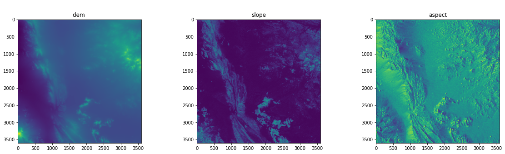
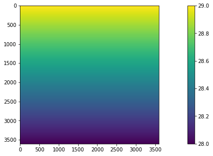
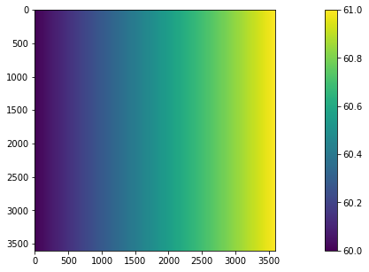
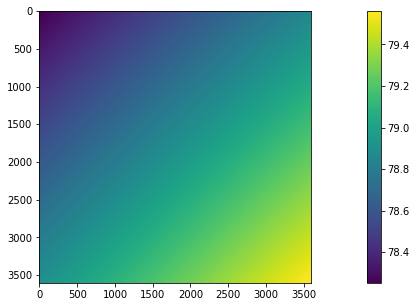
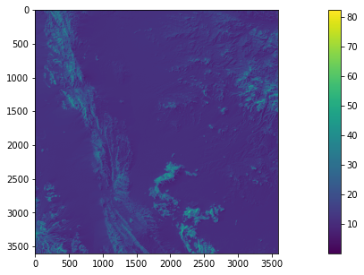
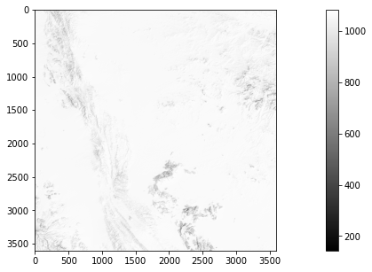
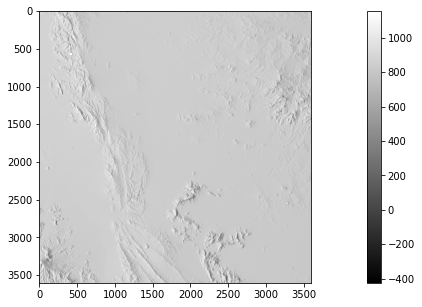

<a href="https://colab.research.google.com/github/moienr/Incdient-Solar-Energy/blob/main/Coolbaugh.ipynb" target="_parent"></a>

# Incdient Solar Energy over time - Coolbaugh Algorithm
**Theraml RS class of University of Tehran** - `Dr. Majid Kiavarz`

2021-22 Second Semester

Student: `Moien Rangzan`

---

```python
from google.colab import drive
drive.mount('/content/drive')
```

    Drive already mounted at /content/drive; to attempt to forcibly remount, call drive.mount("/content/drive", force_remount=True).
    


```python
!pip install rasterio
```

    Requirement already satisfied: rasterio in /usr/local/lib/python3.7/dist-packages (1.2.10)
    Requirement already satisfied: click>=4.0 in /usr/local/lib/python3.7/dist-packages (from rasterio) (7.1.2)
    Requirement already satisfied: snuggs>=1.4.1 in /usr/local/lib/python3.7/dist-packages (from rasterio) (1.4.7)
    Requirement already satisfied: click-plugins in /usr/local/lib/python3.7/dist-packages (from rasterio) (1.1.1)
    Requirement already satisfied: setuptools in /usr/local/lib/python3.7/dist-packages (from rasterio) (57.4.0)
    Requirement already satisfied: affine in /usr/local/lib/python3.7/dist-packages (from rasterio) (2.3.1)
    Requirement already satisfied: cligj>=0.5 in /usr/local/lib/python3.7/dist-packages (from rasterio) (0.7.2)
    Requirement already satisfied: numpy in /usr/local/lib/python3.7/dist-packages (from rasterio) (1.21.6)
    Requirement already satisfied: attrs in /usr/local/lib/python3.7/dist-packages (from rasterio) (21.4.0)
    Requirement already satisfied: certifi in /usr/local/lib/python3.7/dist-packages (from rasterio) (2021.10.8)
    Requirement already satisfied: pyparsing>=2.1.6 in /usr/local/lib/python3.7/dist-packages (from snuggs>=1.4.1->rasterio) (3.0.8)
    


```python
import os
import numpy as np
import matplotlib
import matplotlib.pyplot as plt
import gdal
import rasterio
```

## Getting the coordiantes of our DEM:
`dem.boudns` gives us the latitude and longitude that we can further use


```python
import rasterio
dem = rasterio.open('/content/drive/MyDrive/Colab Notebooks/solar_radiation/bazmandem.tif')
#left edge
long_left = dem.bounds[0]
print(long_left)
#bottom edge
lat_butt = dem.bounds[1]
print(lat_butt)
#right edge
long_right = dem.bounds[2]
print(long_right)
#top edge
lat_top = dem.bounds[3]
print(lat_top)
```

    59.99986111111111
    27.999861111111112
    61.000138888888884
    29.00013888888889
    

## io to numpy array
to change the file into numpy we use `.read()` method


```python
print(type(dem))
dem =dem.read()
print(type(dem))
```

    <class 'rasterio.io.DatasetReader'>
    <class 'numpy.ndarray'>
    


```python
dem.shape
```


    (1, 3601, 3601)


```python
slp = rasterio.open('/content/drive/MyDrive/Colab Notebooks/solar_radiation/bazman_slope.tif')
asp = rasterio.open('/content/drive/MyDrive/Colab Notebooks/solar_radiation/bazman_aspect.tif')
slp =slp.read()
asp =asp.read()
print(slp.shape)
print(asp.shape)
```

    (1, 3601, 3601)
    (1, 3601, 3601)
    

as we can see our arrays have an extra dimention, which is usfull when we have multiple bands, but now that we have only one band we use `np.squeez` to remove these extra dims


```python
dem = np.squeeze(dem)
slp = np.squeeze(slp)
asp = np.squeeze(asp)

print(dem.shape)
print(slp.shape)
print(asp.shape)
```

    (3601, 3601)
    (3601, 3601)
    (3601, 3601)
    

## cut it some slack - WE DONT DO THIS
this is abseloutly a wrong phrase to use but well, in the darkness here comes the nothing

so finding solar incident angle is really process extensive and it takes hours to be calculated for a `3500x3500` raster so i'm using a subset of `200x300`

***SINCE WE INTRODUNCED DOWN_SAMPLING FACTOR IN SUN_POSITION FUNCTION, WE DONT NEED TO TAKE A SUBSET ON LARGE DEM WE CAN CHOOSE BIGGER DOWNSAMPLING FACTOR!***


```python
# dem = dem[0:200,0:300]
# slp = slp[0:200,0:300]
# asp = asp[0:200,0:300]
```


```python
fig, (ax1, ax2,ax3) = plt.subplots(1, 3)
plt.rcParams['figure.figsize'] = [20,5]
fig.suptitle(' ')
ax1.imshow(dem)
ax1.set_title('dem ')
ax2.imshow(slp)
ax2.set_title('slope')
ax3.imshow(asp)
ax3.set_title('aspect')
```


    Text(0.5, 1.0, 'aspect')


    

    


# Latitude and longitude of each pixel
creating two rasters, one contaiong latitude of each pixel and one for longitude
we are interpolating each pixel lat and long using linespace

there are so many things going on in this function so I'll try to explain them all:

`np.linspace(start,stop,numer)`: so our latitude is the same for each row, what we do here is that with linspace we care only one column of the lat raster,
which is from `top_lat` to `buttom_lat` and with the step number of number of rows in original dem(in this case 3601)

`[:,None]` what this does it converst a row wise array into a column wise array

[np.tile()](https://stackoverflow.com/questions/21482728/how-to-fill-a-numpy-array-with-a-gradient-with-a-vectorized-code): what this does is it takse a row or column an it repreats it in rows or columns, with this now we can multiply our 1 column lat into width columns lat_raster


```python
In [422]: np.tile((0,1,2), (5,1))
Out[422]:
array([[0, 1, 2],
       [0, 1, 2],
       [0, 1, 2],
       [0, 1, 2],
       [0, 1, 2]])

In [473]: tile(arange(5)[:,None], 3)
Out[473]:
array([[0, 0, 0],
       [1, 1, 1],
       [2, 2, 2],
       [3, 3, 3],
       [4, 4, 4]])
```


```python
def lat_raster_creator(dem, top_lat,butt_lat):
  height,width = dem.shape
  column = np.linspace(top_lat,butt_lat,height)[:,None]
  lat_ras = np.tile(column,width)
  return lat_ras

def long_raster_creator(dem, long_left,long_right):
  height,width = dem.shape
  row = np.linspace(long_left,long_right,width)
  lat_ras = np.tile(row,(height,1))
  return lat_ras
```


```python
lat_ras = lat_raster_creator(dem,lat_top,lat_butt)
plt.imshow(lat_ras)
plt.colorbar()
plt.show()
```


    

    


```python
long_ras = long_raster_creator(dem,long_left,long_right)
plt.imshow(long_ras)
plt.colorbar()
plt.show()
```


    

    


##Solar Postition moduel - [pysolar](https://pysolar.readthedocs.io/en/latest/)


```python
!pip install pysolar
```

    Requirement already satisfied: pysolar in /usr/local/lib/python3.7/dist-packages (0.10)
    


```python
import datetime
import pysolar.solar as ps
import cv2 as cv
```

## sun position function
this func takes lat,long and time, and will return sun `altitude angle`, `zenith angle`, and `azimuth angle` in **degrees**


```python
def sun_position(lat_long,date,time_hr,country_time_zone_utc=4.5):
  '''
  lat_long is a tupple like (28.3,60.1)
  date is a tupple like (year,month,day)
  time_hr is time of the day in 24hr format
  '''
  y = date[0]
  m = date[1]
  d = date[2]
  dobj = datetime.datetime(y,m,d,time_hr,tzinfo=datetime.timezone.utc) - datetime.timedelta(hours=country_time_zone_utc)

  #lat long
  alt =  ps.get_altitude(lat_long[0],lat_long[1], dobj) # sun altitude angle
  sza = float(90) - alt #sun zenith angle
  azm = ps.get_azimuth(lat_long[0],lat_long[1], dobj) #sun azimuth angle
  return {'alt':alt,'zen':sza,'azm':azm}
```


```python
x= sun_position((28,60) , (2017,7,20) , 10 )
print(x)
```

    {'alt': 53.79708694880695, 'zen': 36.20291305119305, 'azm': 92.93030372172689}
    


```python
from ipywidgets import IntProgress
from IPython.display import display
```

## Sun's position raster
now that we have a function to calculate sun's positions we can apply it for each pixel of a raster - of course it will take a lot of time but leads to a greate percision


```python
#THIS FUNCTION IS OUTDATED AND WILL BE OVERWIRTED IN THE NEXT CELL WHERE WE ADD DOWN_SAMPLING FACTOR

def sun_poistion_raster_creator(lat_raster,long_raster,date,time_hr,country_time_zone_utc=4.5):
  # f is for the progress bar
  f = IntProgress(min=0, max=lat_raster.shape[0]*lat_raster.shape[1]) # instantiate the bar
  display(f) # display the bar


  alt_ras = np.zeros(lat_raster.shape) # creating empty arrays the same size as original dem to be filled later
  zen_ras = np.zeros(lat_raster.shape)
  azm_ras = np.zeros(lat_raster.shape)

  counter  = 0 #just for printing the process progress
  for y, x in np.ndindex(lat_raster.shape): # you can use longitude_raster as well there is no diffrence
    #ndindex returns index of each row and column it is currently at
    f.value += 1

    lat = lat_raster[y,x]
    lng = long_raster[y,x]
    sp = sun_position((lat,lng) , date , time_hr,country_time_zone_utc) #calculating angle for each pixel
    alt_ras[y,x] = sp['alt']
    zen_ras[y,x] = sp['zen']
    azm_ras[y,x] = sp['azm']

  return {'alt_ras':alt_ras,'zen_ras':zen_ras,'azm_ras':azm_ras}
```


```python
# sun_pos_ras = sun_poistion_raster_creator(lat_ras,long_ras, (2017,7,20) , 12)
```


```python
# plt.imshow(sun_pos_ras['alt_ras'])
# plt.colorbar()
# plt.show()
```

## Sun's position raster but with downsampling factor:
so as we saw in the previous function it takse a lot of time calculation solar postion, so in this new function we are introducting the `down_sample_factor`
when it is equal to `1 (or less than 1)` everything is like before, but when we change it to somthing more that `1` for example `2` we resize the image into half of its dimentstions, then we do the calculations, and after that we upsample the image into its original size, like this we loose percision but we can achive a lot faster reasults.

NOTE:  be aware that there is a stupoid thing about `cv2` and that is `cv2.resize()` takes (col,row) insted of (row,col) so thats why we reversed the tuple.


```python
def sun_poistion_raster_creator(lat_raster,long_raster,date,time_hr,country_time_zone_utc=4.5,down_sample_factor=1):
  '''
  when down_sample_factor is equal to `1 (or less than 1)` everything is like before,
  but when we change it to somthing more that `1` for example `2` we resize the image
  into half of its dimentstions, then we do the calculations, and after that we upsample
  the image into its original size, like this we loose percision but we can achive a lot faster reasults.
  '''

  org_shape = lat_raster.shape
  rows,cols = lat_raster.shape
  org_shape= org_shape[::-1]


  if down_sample_factor > 1:
    rows = int(rows/down_sample_factor)
    cols = int(cols/down_sample_factor)
    lat_raster = cv.resize(lat_raster,(cols,rows),cv.INTER_LINEAR)
    long_raster = cv.resize(long_raster,(cols,rows),cv.INTER_LINEAR)

  # f is for the progress bar
  f = IntProgress(min=0, max=rows*cols) # instantiate the bar
  display(f) # display the bar

  alt_ras = np.zeros((rows,cols)) # creating empty arrays the same size as original dem to be filled later
  zen_ras = np.zeros((rows,cols))
  azm_ras = np.zeros((rows,cols))


  counter  = 0 #just for printing the process progress
  for y, x in np.ndindex(lat_raster.shape): # you can use longitude_raster as well there is no diffrence
    #ndindex returns index of each row and column it is currently at
    f.value += 1


    lat = lat_raster[y,x]
    lng = long_raster[y,x]
    sp = sun_position((lat,lng) , date , time_hr,country_time_zone_utc) #calculating angle for each pixel
    alt_ras[y,x] = sp['alt']
    zen_ras[y,x] = sp['zen']
    azm_ras[y,x] = sp['azm']

  if down_sample_factor > 1:
    alt_ras = cv.resize(alt_ras,org_shape,cv.INTER_LINEAR)
    zen_ras = cv.resize(zen_ras,org_shape,cv.INTER_LINEAR)
    azm_ras = cv.resize(azm_ras,org_shape,cv.INTER_LINEAR)

  return {'alt_ras':alt_ras,'zen_ras':zen_ras,'azm_ras':azm_ras}
```


```python
sun_pos_ras = sun_poistion_raster_creator(lat_ras,long_ras, (2017,7,20) , 12,down_sample_factor=50)
```


    IntProgress(value=0, max=5184)


## sun pos raster reasult
 as you can see sun position has been calculated for each pixel and now we have a rster that we can use in coolbaugh formula


```python
plt.imshow(sun_pos_ras['alt_ras'])
plt.colorbar()
plt.show()
```


    

    


```python
from numpy import cos,sin,radians
```

## Solar incident angle:

this how we we find the exact incident angle for each pixel:

`cos_i = cos(s) * cos(z) + sin(s) * sin(z) * cos(a - o)`


```python
def solar_incident_angle(slope_raster,solar_zenith_raster,solar_azimuth_raster,aspect_raster):
  s= radians(slope_raster)
  z= radians(solar_zenith_raster)
  a= radians(solar_azimuth_raster)
  o= radians(aspect_raster)

  cos_i = cos(s) * cos(z) + sin(s) * sin(z) * cos(a - o)

  return np.degrees(np.arccos(cos_i))

```


```python
sun_incident_ras = solar_incident_angle(slp,sun_pos_ras['zen_ras'],sun_pos_ras['azm_ras'],asp)
```

0 means that sun is hiting the surface orthagnali, 90 means its rays are paralell to the surface


```python
plt.imshow(sun_incident_ras)
plt.colorbar()
plt.show()
```


    

    


## Coolbaugh formula directly from Dr.Kiavarz notes


```python
def coolbaugh(solar_zenith_raster,solar_incident_raster):
  z =radians(solar_zenith_raster)
  s0 = 1367 #[w*m^2]
  mz = 1 - (0.2/(cos(z)**2))
  zp  = radians(solar_incident_raster)

  cb  = s0 * mz * cos(zp)

  return cb
```


```python
ise = coolbaugh(sun_pos_ras['zen_ras'],sun_incident_ras) # ise = inicident solar energy
```

throughout this work I used `ise` and `cb` names for inicident solar energy, interchangably, they are the same thing


```python
plt.imshow(ise,cmap='gray')
plt.colorbar()
plt.show()
```


    

    


## Coolbaugh through out the day


```python
def coobaugh_day(slope_raster,aspect_raster,lat_raster,long_raster,date,time_hour_start=6,time_hour_end=17,country_time_zone_utc=4.5 ,down_sample_factor=1):
  sun_pos_ras_list = []
  for t in np.arange(time_hour_start,time_hour_end+1):
    sun_pos_ras_list.append(sun_poistion_raster_creator(lat_raster,long_raster, date , t,country_time_zone_utc,down_sample_factor))

  sun_incident_ras_list = []
  for sun_pos_ras in sun_pos_ras_list:
    sun_incident_ras_list.append(solar_incident_angle(slope_raster,sun_pos_ras['zen_ras'],sun_pos_ras['azm_ras'],aspect_raster))

  ise_list = []
  for sun_pos_ras,sun_incident_ras in zip(sun_pos_ras_list,sun_incident_ras_list):
    ise_list.append(coolbaugh(sun_pos_ras['zen_ras'],sun_incident_ras))

  #delay factor list should be like [1/2n , ... , 1/4 , 1/2 , 1]
  #the closest the hour the more effect it has
  df_list = []
  for d in range(len(ise_list)):
    df_list.append(1/2**d)
  df_list.reverse()

  cb_sum = 0
  for e,d in zip(ise_list,df_list):
    cb_sum += e*d

  return {'cb_sum':cb_sum , 'ise_list':ise_list ,'df_list':df_list,'sun_incident_ras_list':sun_incident_ras_list,'sun_pos_ras_list':sun_pos_ras_list}
```

## note:
we calculate the reasult for 12 hours of daylight becasue we don't have any light in nights but the coolbaugh formula returns some value which are defenely wrong.

`6am to 5pm`


```python
cb = coobaugh_day(slp,asp,lat_ras,long_ras,(2017,7,20),time_hour_start=6,time_hour_end=17,down_sample_factor=50)
```


    IntProgress(value=0, max=5184)


    IntProgress(value=0, max=5184)


    IntProgress(value=0, max=5184)


    IntProgress(value=0, max=5184)


    IntProgress(value=0, max=5184)


    IntProgress(value=0, max=5184)


    IntProgress(value=0, max=5184)


    IntProgress(value=0, max=5184)


    IntProgress(value=0, max=5184)


    IntProgress(value=0, max=5184)


    IntProgress(value=0, max=5184)


    IntProgress(value=0, max=5184)


    /usr/local/lib/python3.7/dist-packages/ipykernel_launcher.py:9: RuntimeWarning: invalid value encountered in arccos
      if __name__ == '__main__':
    


```python
cb['df_list']
```


    [0.00048828125,
     0.0009765625,
     0.001953125,
     0.00390625,
     0.0078125,
     0.015625,
     0.03125,
     0.0625,
     0.125,
     0.25,
     0.5,
     1.0]


```python
np.max(cb['ise_list'][0]-ise)
```


    136640.08755124966


```python
plt.imshow(cb['cb_sum'],cmap='gray')
plt.colorbar()
plt.show()
```


    

    


```python
cb['cb_sum'].shape
```


    (3601, 3601)


```python
cv.imwrite('coolbaugh.tif',cb['cb_sum'])
```


    True


# final resault
the stretching here is not good but when we open the final data in arcgis with SD stretch we get this:


# Diffrence

one usfeul thing that I found is; now that we wrote our code in a functial way we can calculate ise for diffrent hours, days and seasons, and compare the Incdient solar energy:

the image below is the difrrence between two hours


```python

plt.imshow(cb['ise_list'][1]-cb['ise_list'][2],cmap='gray')
plt.colorbar()
plt.show()
```


    

    

